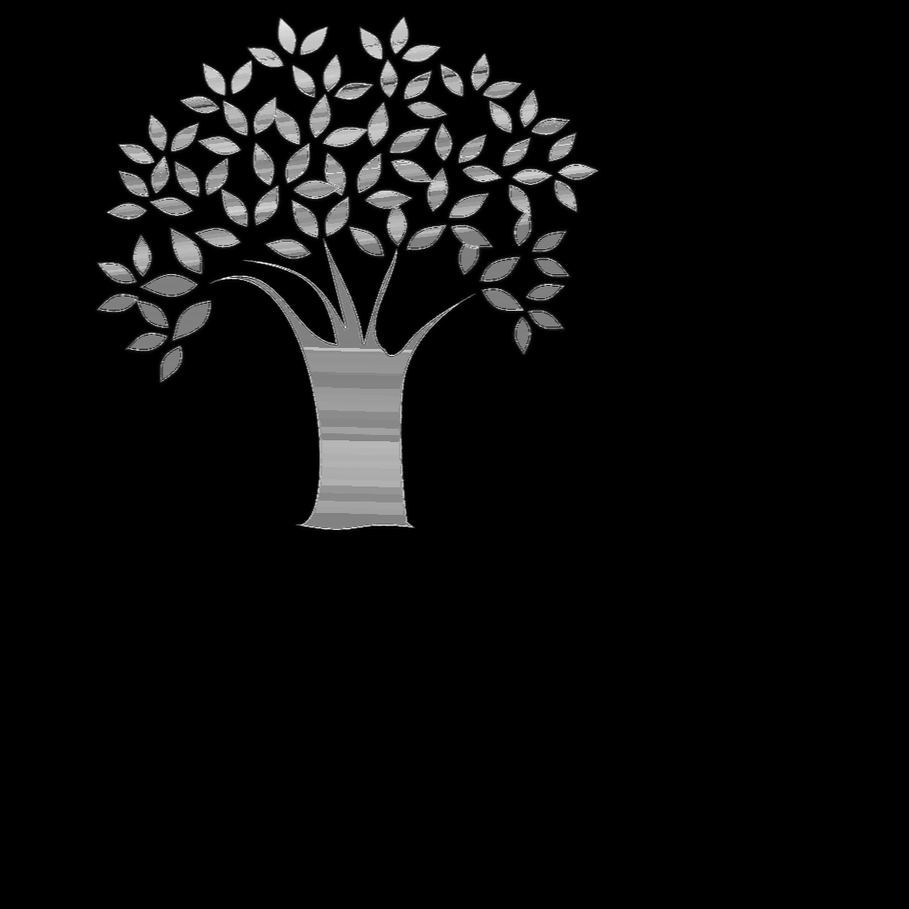
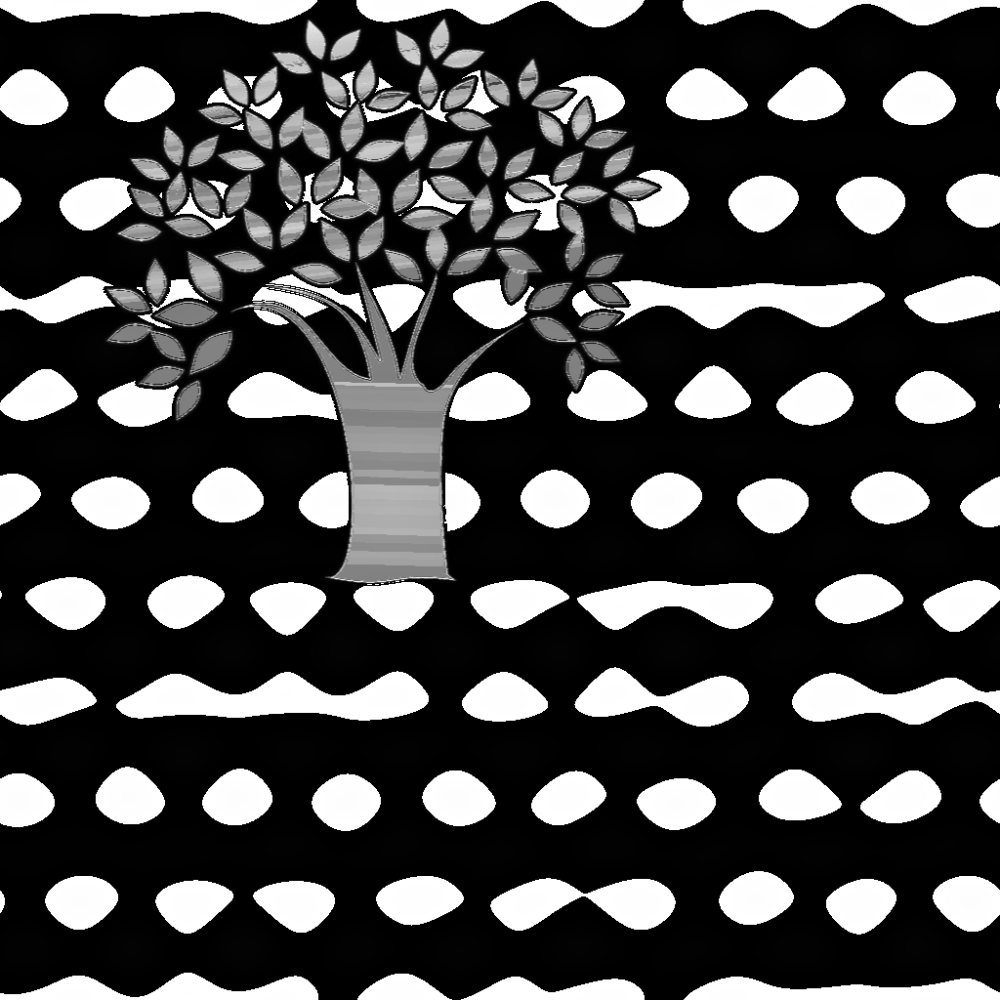
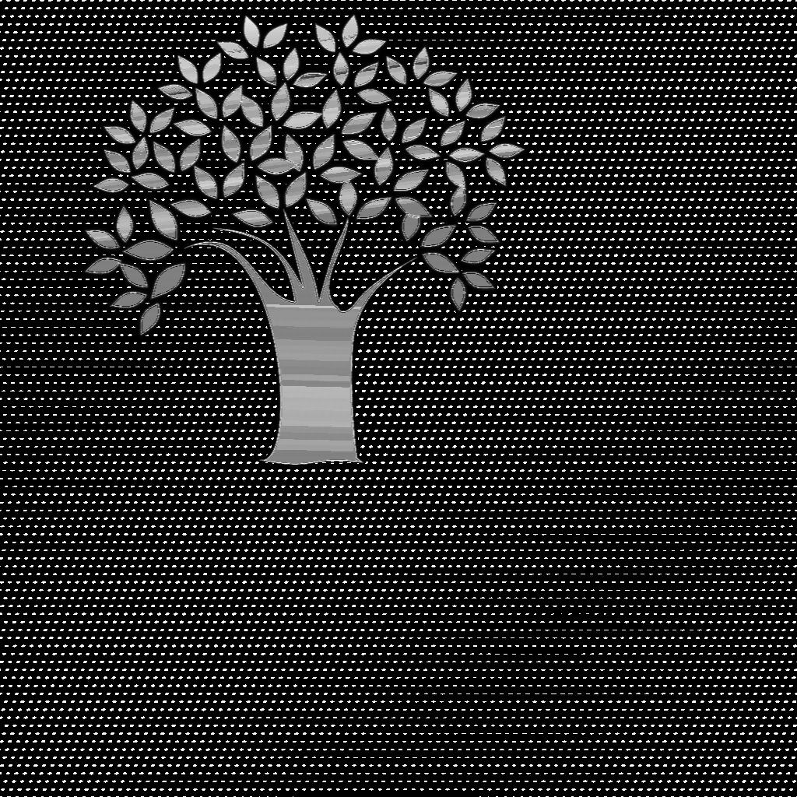
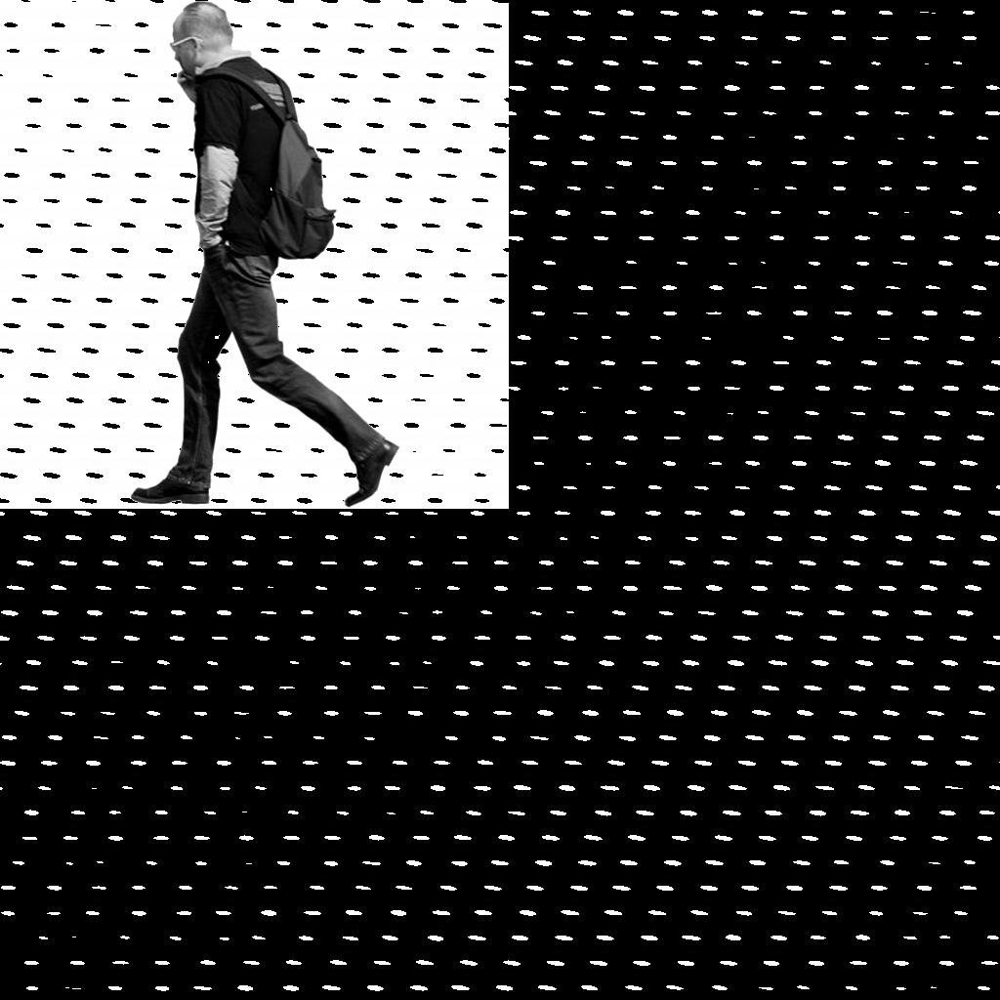

# A1 Report
#### Alex DeCourcy (adecourc) and Katie Spoon (kspoon)  
## Part 1
### How to Run
For 1.1 run "./watermark p2 1.1 inputfile outputfile"  
For 1.2 run "./watermark p2 1.2 inputfile outputfile"  
For 1.3 (add watermark) run "./watermark p2 1.3 inputfile outputfile add N"  
For 1.3 (check watermark) run "./watermark p2 1.3 inputfile outputfile check N", which checks inputfile for N

### Design Decisions
We used several "magic" parameters in part 1.3, including **l** (number of binary digits produced by a random number generator seeded with N), **r** (radius of circular pattern for fourier transform), **alpha** (multiplication constant in fourier transform) and **t** (threshold for correlation coefficient to be above). Here we will explain our reasoning for the values we chose for each one.
* **l = 5**: we found that with high values of **l**, strange artifacts (mostly patterns of dots) would appear in the resulting image
* **r = 40**: we found that low values or **r** were necessary for our program to detect the watermark in the image, but high values of **r** combined with high values of **alpha** resulted in odd circular artifacts (rows of blobs) in the background of the image
* **alpha = 2**: as mentioned before, high values of **alpha** resulted in weird artifacts (whether **r** was high as well or not), so we knew we needed a low **alpha**. However, we struggled because in order to detect the watermark in the image, higher values of **alpha** were helpful. We compromised by using a lower **alpha** but also lowering **r**.
* **t = 0.5**: we found that the threshold needed to be very high in order to weed out false positives. However, it needed to be low enough to actually detect the correct watermark. 0.5 was the highest it could be in order to still detect the watermark. See the experiment we did to test this in Performance Evaluation (Quantitative Results).

### Performance Evaluation
For 1.2, we hard-coded the removal of the noise (allowable by the assignment), but it could've been done in a more sophisticated way.

For 1.3, below is a summary (both qualitative and quantitative) of the parameters (**l**, **r**, **alpha** and **t**) we chose.  
#### Qualitative Results (Example Images)
##### Original Image (Tree):

##### For high value of l:

##### For low value of r:

##### For high value of alpha:

One other important assumption that we make with this specific set of parameters is that the png images that are used do not have transparent backgrounds. See an example below.
##### Original Image (person - with transparent background):

##### For set of parameters above (l = 5, r = 40, alpha = 2, t = 0.5):

#### Quantitative Results 
To test the false positive rate of our parameters, we embedded the watermark "35" into the tree image above using the "add" operation, then tested all integers 1-100 with the "check" operation. We had 7 false positives (16, 21, 40, 43, 49, 86, and 100), resulting in a false positive rate of 7%.
  
## Part 2
### How to Run

./detect input_image

### Design Decisions

We deviated quite a bit from the suggestions in the PDF in this assignment. We found that using a simple blur and edge filter alone resulted in images that were extremely noisy and very difficult to use. We attempted to use very conservative and very aggressive blurring, with gaussians with a deviation of 3, 5, 7, 9, and mean filters of size 3, 5, 7, and 11, however this didn't seem to drastically improve our results with the edge filter. We even tried doing various forms of edge filters, making them smaller and larger but, again, the improvement wasn't very great. That's not to say that there was no improvement at all, just that it brought the noise level from very bad to pretty bad.

We were asked on Piazza to compare our method to the suggested method in the PDF, however we found that it would have taken a very large amount of work to get results from the suggested PDF method and it was very obvious that those results would be very poor. As we had already spent a large amount of time trying to improve the results through the use of different blurs and edge filters, we decided to finish the project using our modified method and only report those results here.

We started by importing the image as a color image. We applied an aggressive blur to each color plane though the use of a mean filter. We then passed these color planes to a function that filtered out any pixel that wasn't "gray" enough given some parameters. This was a very conservative filter, erring on the side of leaving too much noise behind rather than than accidentally removing some signal from that noise. Any removed points were turned white. This color filter returned a grayscale image of the remaining pixels.

The remaining pixels were run through a clustering algorithm, which was a very simplified form of DBScan. This algorithm kept any point that was surrounded by all non-white points as a "core" point. It also kept any point that was in direct contact with any "core" point (which were called "edge" points in the code). This helped remove small, isolated patches of gray pixels that were left behind in the color filtering step.

After the clustering step, the image was turned to black and white. This helped solve some problems with gradient noise in the grayscale image that couldn't be removed by the blurring, and caused false edges to be added during edge filtering.

Next, an edge filter was applied. There was still a large amount of noise, much of which was due to pins on the ICs or gradient noise in the IC images themselves, so a gaussian filter was applied to the results to blur the edges and "connect" various edge points to one another. Each edge blur was applied independent of the other (that is to say that the vertical and horizontal edges were blurred before being combined together).

In the next step, horizontal and vertical lines were extracted from the horizontal and vertical edge planes. A line was considered a series of 30 or more consecutive edge pixels. When a line was found it was extended from both ends by 10%. The reason for this was that noise often caused parts of the edges to be left out during the edge-filtering process and some of the ICs had non-right angle corners. Some of these issues were taken care of in the edge-blurring process, but not all of them. This step caused broken lines to be re-joined and intersections to be found.

Finally, our horizontal and vertical edges were combined into a single image and, for the empty (non-line) space in our images, a flood fill algorithm was used to find clusters enclosed by the lines. Each cluster was evaluated to see if it was "box"-like enough (based on the filled spaces in the enclosed aread), if it was small and large enough to be considered an IC, and if the proportion of the sides was within certain parameters.

### Performance Evaluation

Our algorithm worked very well on images 1-4, and with varying success on the other images. Image 5 was generally difficult as the image was very low quality and had a lot of gradient in the IC. Even with very aggressive blurring it was very hard to extract a single IC from this image. Image 8 was also difficult as there seemed to be some sort of strange tint in this image that made it difficult to find edges or apply a proper color filter.

For images 6, 7, and 9, the algorithm found a good deal of the ICs, but with a large number of false positives. Many of these false positives would be difficult to filter out in general as they look like ICs (black paint on capacitors, black transitors, etc). However a good number of these false positives could probably be removed through various additional pre-processing and post-processing methods. For example, after the algorithm has detected ICs, the median color of the ICs could be found. This median color could be compared to all found ICs and any IC that deviated too much from this median could be removed. Additionally, this median color could be used to re-process the image from the beginning to use a more precise color filter.

For the false negatives (ICs that weren't found), again information from the found ICs could be used to re-process the image more intelligently. For example, of the found ICs, the size and proportion of each could be found and sliding window filters could then be created off of these templates to search for additional ICs that may have been missed. Additionally, pre-processing could be used to make a better color filter. To use image 8 as an example, a better color filter could have been constructed for this image if the image was scanned first to find the mean and median colors of each type. Rather than looking for an "objective" gray in this image we could then adjust what we considered "gray" based on this information.

Finally, it should be mentioned that we didn't have a great way of measuring the "confidence" of our ICs, so we just set them all to 0 in our output.

Here are some examples of our results:
##### Image 2:

##### Image 3:

##### Image 9:

Our detect.cpp outputs 3 items per image (as requested by the assignment): "edges.png", "detected.png" and "detected.txt"
